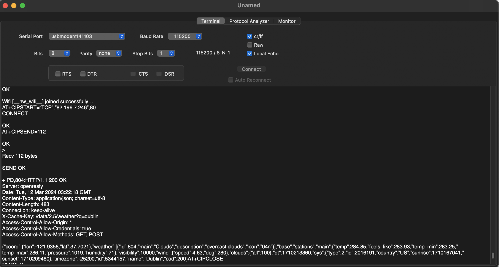

* Sign in/Create account in [Open Weather API](https://openweathermap.org/) and get the [API keys](https://home.openweathermap.org/api_keys)    
         
      
* Provide your **WiFi name**, **WiFi password**, and **API Keys** from OpenWeatherMap.org in `main.c` as shown below to make GET request     
         
       
      
      
      
*  API response in JSON from `OpenWeatherMap.org` on SerialTool (for MacOSX)     
     
           
     
     
     
    
		
		 
    
		
     
		  	 			  	 		
    		 	 			 					  	 		
    		 	 			
    	 	 				  
    		 	 			
    
		
		
    

			
	 		 

         
		 
           
		 
     
		  	 						 		 
		     
		 
	
    
    
    
    
    
    
    
    
    
  
    
    
    
    
    
    
    
    

     
     

     
     

     
    
    