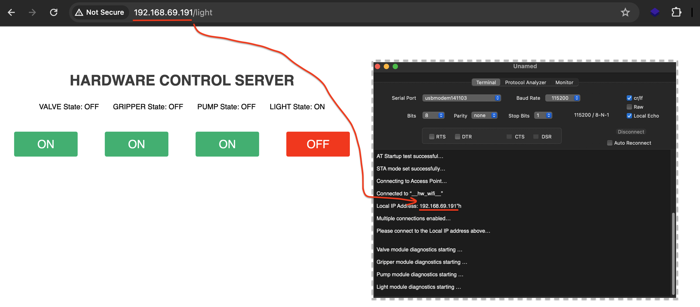

- Run the App `11_interactive_webserver` in the STM32 board and type following IP shown on Debug UART on to the Web browser to control different modules     
     
		 
		 
		 
    
		
     
		  	 			  	 		
    		 	 			 					  	 		
    		 	 			
    	 	 				  
    		 	 			
    
		
		
    

			
	 		 

         
		 
           
		 
     
		  	 						 		 
		     
		 
	
    
    
    
    
    
    
    
    
    
  
    
    
    
    
    
    
    
    

     
     

     
     

     
    
    