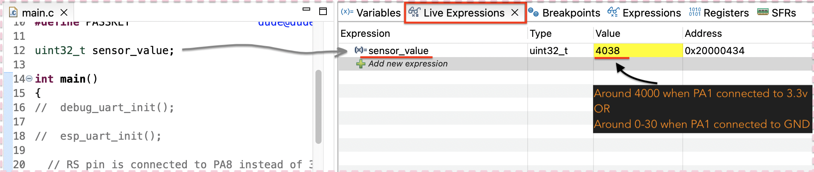

## ADC Driver     
     
- ESP01s connection is not needed in this project as we are only testing the ADC driver funtionality.     
    
- Connect one jumper wire to **PA1** and run `12_adc_driver` in Debug mode.   
     
- Now drag/drop variable `sensor_value` from `main.c` into _Live Expressions_ window.    
     
- Now hit **Resume (F8)** button while in Debug mode to execute all the code at once.    
    
- Now look at the _Value_ of `sensor_value` in _Live Expressions_ window, which supposed to be around _4000_ when PA1 connected to 3.3v or 0-30 when GNDed     
     
     
         
 
		 
    
		
     
		  	 			  	 		
    		 	 			 					  	 		
    		 	 			
    	 	 				  
    		 	 			
    
		
		
    

			
	 		 

         
		 
           
		 
     
		  	 						 		 
		     
		 
	
    
    
    
    
    
    
    
    
    
  
    
    
    
    
    
    
    
    

     
     

     
     

     
    
    