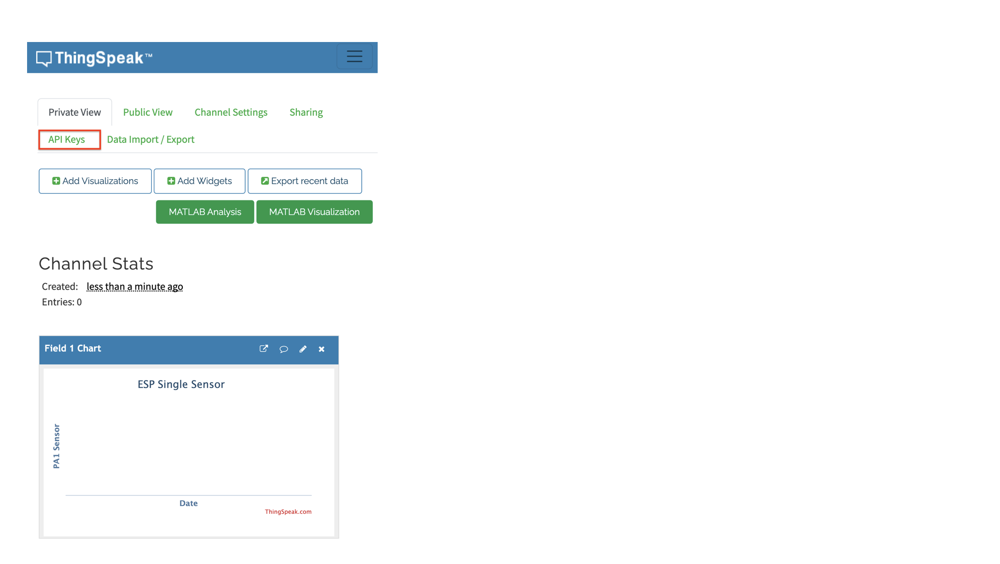

We used [ThingSpeak](https://thingspeak.com/) in this project, Which allows us to send our data to cloud and provide realtime analytics in the dashboard.    
    
You need [MathWorks](https://mathworks.com/) account to access ThingSpeak.   
     
You can have multiple [Channels](https://thingspeak.com/channels) to receive data from different projects.      
     
Create new channel by providing the **Name** i.e. _ESP Single Sensor_, **Field 1** as _PA1 Sensor_, leave everything else blank and hit _Save Channel_   
    
Our created channel look something like below image. Next click on **API Keys** to get API Keys for _Write_ and _Read_ from the channel.       
		
     
		  	 			  	 		
    		 	 			 					  	 		
    		 	 			
    	 	 				  
    		 	 			
    
		
		
    

			
	 		 

         
		 
           
		 
     
		  	 						 		 
		     
		 
	
    
    
    
    
    
    
    
    
    
  
    
    
    
    
    
    
    
    

     
     

     
     

     
    
    