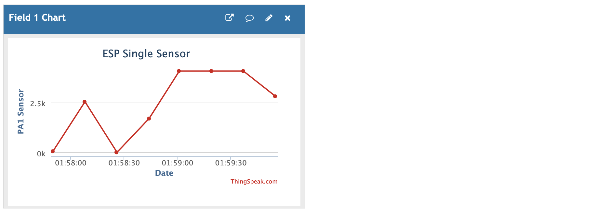

## Send potentiometer reading from ADC channel to the cloud      
     
Connect potentometer's middle pin to the PA1 of NUCLEO-F411RE and either side pins to 3.3v and GND.   
     
Rest of the connection details of NUCLEO-F411RE with ESP01s chip can be found in [README](https://github.com/noargs/ARM-cortex-m-wifi-driver-development/blob/main/README.md).     
      
We use [ThingSpeak](https://thingspeak.com/) in this project, Which allows us to collect, analyse, act on our IoT data on the cloud and provide realtime analytics in the dashboard.    
    
You need [MathWorks](https://mathworks.com/) account to access ThingSpeak.   
     
You can have multiple [Channels](https://thingspeak.com/channels) to receive data from different projects.      
     
Create new channel by providing the **Name** i.e. _ESP Single Sensor_, **Field 1** as _PA1 Sensor_, leave everything else blank and hit _Save Channel_   
    
Our created channel look something like below image. Next click on **API Keys** to get API Keys for _Write_ and _Read_ from the channel.       
		
    
     
`esp82xx_thingspeak_send()` API uses AT command `AT+CIPSTART` in `esp82xx_lib.c` to create TCP connection and communicate with ThingSpeak via GET request   
     
      
      
Replace the `WRITE_API_KEY` macro in `main.c` with your _Write API Key_ from ThingSpeak and Build/Run the project on to your board, and open Serial capture tool _RealTerm_ for Windows or _SerialTools_ for MacOS to get debug output.         
      
There's 3 seconds delay between each request `systick_delay_ms(3000)` to ThingSpeak.     
     
          
      
                
     
You can make following _API Requests_    
     
**Write a Channel Feed**   
`GET https://api.thingspeak.com/update?api_key=<YOUR_WRITE_API_KEY_HERE>&field1=0`      
     
**Read a Channel Feed**   
`GET https://api.thingspeak.com/channels/<YOUR_CHANNEL_ID>/feeds.json?api_key=<YOUR_READ_API_KEY_HERE>&results=2`        
     
**Read a Channel Feed**   
`GET https://api.thingspeak.com/channels/<YOUR_CHANNEL_ID>/fields/1.json?api_key=<YOUR_READ_API_KEY_HERE>&results=2`    
     
**Read Channel Status Updates**   
`GET https://api.thingspeak.com/channels/<YOUR_CHANNEL_ID>/status.json?api_key=<YOUR_READ_API_KEY_HERE>`     
     
     
## Other application examples uses ThingSpeak     
     
- [Collect and analyze energy data](https://www.mathworks.com/company/user_stories/cadmus-collects-and-analyzes-energy-data-in-near-real-time-using-matlab-and-the-thingSpeak-internet-of-things-platform.html?s_eid=EML_15480)          
     
- [Building the Internet of Things with the ESP8266 Wi-Fi Module and ThingSpeak](https://www.mathworks.com/esp8266?s_eid=EML_15480)         
     
- [Analyze data from a weather station](https://makerzone.mathworks.com/stories/arduino-stories/weather-station-analysis-revisited/?s_eid=EML_15480)       
     
- [Forecast wind-driven tide levels with an ultrasonic tide gage](https://www.mathworks.com/company/newsletters/articles/developing-an-iot-analytics-system-with-matlab-machine-learning-and-thingspeak.html?s_eid=EML_15480)      
        
        
## Resources to get started    
     
- [Documentation](https://www.mathworks.com/help/thingspeak/?s_eid=EML_15480)       
     
- [Examples](https://www.mathworks.com/help/thingspeak/examples.html?s_eid=EML_15480)                                   
                        
                      
                     
            
        
          
     
        
		  	 			  	 		
    		 	 			 					  	 		
    		 	 			
    	 	 				  
    		 	 			
    
		
		
    

			
	 		 

         
		 
           
		 
     
		  	 						 		 
		     
		 
	
    
    
    
    
    
    
    
    
    
  
    
    
    
    
    
    
    
    

     
     

     
     

     
    
    