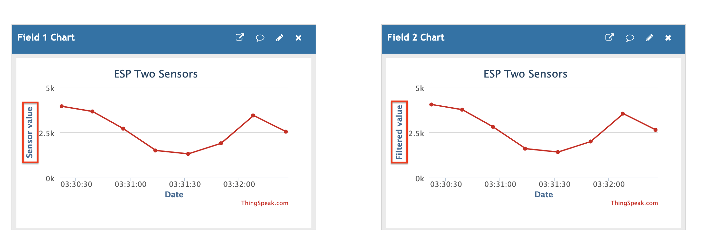

## Send multiple sensor reading to the cloud     
    
Look into the README of previous project `13_esp82xx_sensor_data_cloud` to get the background knowledge    
      
One value taken from potentiometer `sensor_value` and another value `filtered_value` is made up (simulated) by adding constant (i.e. 100) to potentiometer reading (i.e. `sensor_value + 100`).   
     
Create new channel by providing the **Name** i.e. _ESP Two Sensors_, **Field 1** as _Sensor value_ and **Field 2** as _Filtered value_, leave everything else blank and hit _Save Channel_          
      
Replace the `WRITE_API_KEY` macro in `main.c` with your _Write API Key_ from ThingSpeak, Replace `SSID_NAME`, `PASSKEY` with you WiFi _Name_ and _Password_.     
    
Connect potentometer's middle pin to the PA1 of NUCLEO-F411RE and either side pins to 3.3v and GND.         
     
Build/Run the project on to your board, and open Serial capture tool _RealTerm_ for Windows or _SerialTools_ for MacOS to get debug output.         
      
There's 3 seconds delay between each request `systick_delay_ms(3000)` to ThingSpeak (Rotate the potentiometer knob slowly in every 3 seconds)    
    
           
    
		
		
    

			
	 		 

         
		 
           
		 
     
		  	 						 		 
		     
		 
	
    
    
    
    
    
    
    
    
    
  
    
    
    
    
    
    
    
    

     
     

     
     

     
    
    